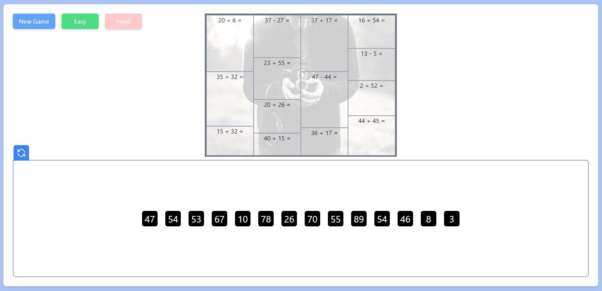
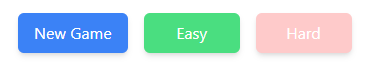
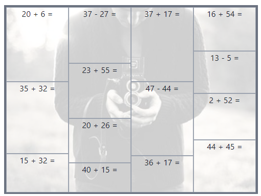

# IRES MATH PUZZLE GAME

HI, Here is my Demo link: https://ires-math-puzzle.vercel.app/

This section is about to introduce some feature of this project:

This is a project about Math Puzzle, you can choose the number that match with the math puzzle, if you choose right the overlay of math puzzle will disappear, otherwise it will just back to it position.

Forward to the detail. The website have 3 main area:

- The buttons area:
  
- The image - math puzzle area:
  
- The numbers area:
  

A. The button area have 3 buttons:

- New Game: This button will just make a new game base on current level easy or hard.
- Easy: This button will change game level to EASY if current level is HARD. Cannot choose again if it is EASY currently
- Hard: This button will change game level to HARD if current level is EASY. Cannot choose again if it is HARD currently

B. The image - math puzzle area:
This area will show an image with multiple math puzzle overlay on
\*\*\* This may be have some UI bug if you use small screen, you can reset the game for another math puzzle layout. And also, my project still not responsive.

C. The numbers area:

- This area will show all the result of the math puzzle list
- A shuffle icon at top left of the box, you can use this icon for shuffle current numbers if you want.
  \*\*\* At the beginning, I plan to use this icon for random position of all numbers. But it conflicts with Drag and Drop feature, so I remove random position feature at this time

========================
About the game, I have 2 level easy & hard:

- In easy: The numbers will be normal, all numbers will be just at its position after you choose right answer. If you choose wrong, browser will alert "Wrong answer" and put number back to its position
- In hard: The numbers will be shuffle whenever you choose right answer. If you choose wrong, it will be same as easy level

About the gameplay, You can hover on the image and choose which math puzzle you want to find answer, or the second way is You can drag the answer to the math puzzle for matching them

After you solve all math problem, There will show a popup about "Congratulation, You win" with a button "New Game" to Play again, or you can click out of the popup to hide it and see the image.

That's all of this project. Hope you like it. Thank you for your time!
